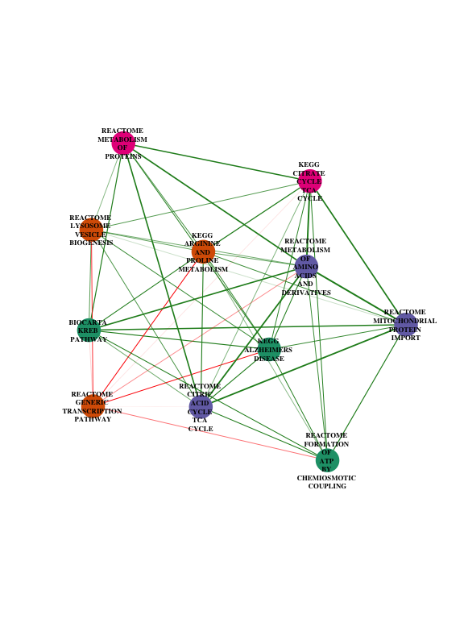

# Clustering with PathCor
Yered Pita-Juarez  
03/21/17  

The purpose of this document is to show a new approach to cluster the pathways by using the pathway correlation to define a distance. I believe that this approach emphasizes how closely related are pathways of interest and helps to interpret the results from PCxN.

## Example

For this document, I considered the top 10 neighbors of the `KEGG_ALZHEIMERS_DISEASE` from the canonical pathways gene set collection with the current default filters for the pathway coexpression network

* A correlation magnitude higher than 0.05 $(|\text{PathCor}| > 0.05)$
* Significant correlation coefficients $(p < 0.05)$

## Clustering based on Correlation Coefficients

In one of the previous implementation of the webtool, the clustering of the results was based on the correlation matrix. From the results from PCxN,

* Construct a correlation matrix 
* Compute a distance between all pathways of interest using the correlation matrix
* Perform hierarchical clustering

For this example, I used the default option in the `hclust` function in R (Euclidean distance and complete linkage to perform the hierarchical clustering).

The current output is a heatmap, with the rows and columns ordered according to the clustering results.

<!-- -->

I think the dendogram by itself is also a useful plot to include as part of the output

<!-- -->

## Defining a Distance

We could use the actual correlation coefficients to define a distance. I propose the following

$d = 1 - |\text{PathCor}|$

Note that $0 \leq d \leq 1$, and

* $d=0$, when two pathways are perfectly correlated ($\text{PathCor} = 1$ or $\text{PathCor} = -1$)
* $d=1$, when $\text{PathCor}=0$

Since the pathway correlation describes the relationships between pathways, this distance will be small for closely related (highly correlated) pathways and larger for unrelated (uncorrelated) pathways.

## Clustering based on $d = 1 - |\text{PathCor}|$

I clustered the top 10 neighbors of `KEGG_ALZHEIMERS_DISEASE` using the distance $d$ instead of the Euclidean distance applied on the correlation matrix

* Construct a correlation matrix 
* Calculated $d = 1 - |\text{PathCor}|$
* Perform hierarchical clustering with $d$

Below are the heatmap and dendogram for this approach.

<!-- -->

<!-- -->

## Network Layout based on $d = 1 - |\text{PathCor}|$ 

In order to illustrate how we could integrate the distance based on the pathway correlations into the network layout, I applied a cut-off to the hierarchical tree to define 4 modules, and colored the pathways accordingly. In this manner, we can see more clearly how the network layout relates to the distance $d$ and the clustering results.

Below are the heatmap and the dendogram with the pathways colored according to their module membership.

<!-- -->

<!-- -->

I used the Fruchterman-Reingold layout algorithm with $d$ as the edge weights. The node color matches the module membership, the edges are colored according to the sign of the correlation coefficients (green for positive, red for negative) and the edge width is proportional to the magnitude of the correlations. Incorporating the distance $d$ in the layout helps to emphasize the relationship between the pathways and complements the clustering results.

<!-- -->

## Final Remarks

I have the following suggestions for the webtool

- use $d = 1 - |\text{PathCor}|$ to cluster the pathways in the webtool
- include a dendogram as part of the clustering results
- use $d$ in one of the network layouts
